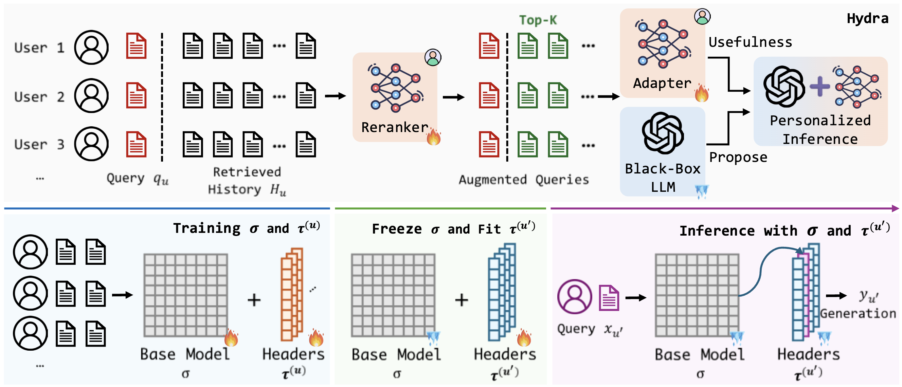

# HYDRA
This repository contains the code used in the paper [HYDRA: Model Factorization Framework for Black-Box LLM Personalization](https://arxiv.org/abs/2406.02888), which will appear at NeurIPS 2024. It also provides a framework for factorizing the model to personalize the black-box LLMs.

## Framework


## Experiments
You need to first download the [LaMP](https://github.com/LaMP-Benchmark/LaMP) benchmark data into the directory `data/`. 

### Data Generation
For both reranker and adapter training, you need to generate the data and annotation first:
```python
python main-reranker.py --seed 40 --debug generation --config configs/bbox-train/LaMP_2.yaml
```
or:
```python
python main-adapter.py --seed 40 --debug generation --config configs/bbox-train/LaMP_2.yaml
```
We will update a detailed guidance of data generation in the following versions.

### Model Training
Use `reranker-gen` option to train the reranker and also generate training data for the adapter.
```python
CUDA_VISIBLE_DEVICES=2 python main-reranker.py --config configs/reranker/train-topk-final/LaMP_5.yaml --debug reranker-gen
```
For Adapter:
```python
CUDA_VISIBLE_DEVICES=1 python main-adapter.py --config configs/bbox-p/LaMP_5.yaml --debug trainer
```

### Release Updates
- [x] ~~Release core training code;~~
- [ ] Release data generation code and guidance;
- [ ] Update camera-ready version of code;
- [ ] Polish and prettier the current code base.

## Citation
If you find this repository valuable for your research, we kindly request that you acknowledge our paper by citing the following paper. We appreciate your consideration.
```
@misc{zhuang2024hydramodelfactorizationframework,
      title={HYDRA: Model Factorization Framework for Black-Box LLM Personalization}, 
      author={Yuchen Zhuang and Haotian Sun and Yue Yu and Rushi Qiang and Qifan Wang and Chao Zhang and Bo Dai},
      year={2024},
      eprint={2406.02888},
      archivePrefix={arXiv},
      primaryClass={cs.CL},
      url={https://arxiv.org/abs/2406.02888}, 
}
```